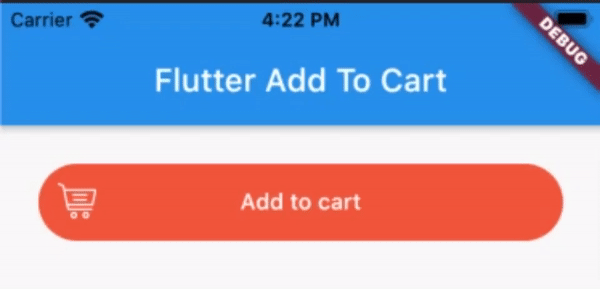

# Flutter Add To Cart Button

A Flutter package to create Add To Cart Button. It will be useful for your awesome app.

This creates a button that is used to let the users can add items to their shopping cart. This will be useful for the eCommerce app.



### Example

```dart
import 'package:flutter/material.dart';
import 'package:flutter_add_to_cart_button/flutter_add_to_cart_button.dart';

void main() => runApp(MyApp());

class MyApp extends StatefulWidget {
  @override
  _MyAppState createState() => _MyAppState();
}

class _MyAppState extends State<MyApp> {
  AddToCartButtonStateId stateId = AddToCartButtonStateId.idle;
  @override
  Widget build(BuildContext context) {
    return MaterialApp(
      title: 'Example',
      theme: ThemeData(
        primarySwatch: Colors.blue,
      ),
      home: Scaffold(
        appBar: AppBar(
          title: Text('Flutter Add To Cart'),
        ),
        body: SingleChildScrollView(
          child: Column(
            children: [
              Center(
                child: Padding(
                  padding: const EdgeInsets.all(24),
                  child: AddToCartButton(
                    trolley: Image.asset(
                      'assets/ic_cart.png',
                      width: 24,
                      height: 24,
                      color: Colors.white,
                    ),
                    text: Text(
                      'Add to cart',
                      textAlign: TextAlign.center,
                      style: TextStyle(
                        fontSize: 14,
                      ),
                      maxLines: 1,
                      overflow: TextOverflow.fade,
                    ),
                    check: SizedBox(
                      width: 48,
                      height: 48,
                      child: Icon(
                        Icons.check,
                        color: Colors.white,
                        size: 24,
                      ),
                    ),
                    borderRadius: BorderRadius.circular(24),
                    backgroundColor: Colors.deepOrangeAccent,
                    onPressed: (id) {
                      if (id == AddToCartButtonStateId.idle) {
                        //handle logic when pressed on idle state button.
                        setState(() {
                          stateId = AddToCartButtonStateId.loading;
                          Future.delayed(Duration(seconds: 3), () {
                            setState(() {
                              stateId = AddToCartButtonStateId.done;
                            });
                          });
                        });
                      } else if (id == AddToCartButtonStateId.done) {
                        //handle logic when pressed on done state button.
                        setState(() {
                          stateId = AddToCartButtonStateId.idle;
                        });
                      }
                    },
                    stateId: stateId,
                  ),
                ),
              ),
            ],
          ),
        ),
      ),
    );
  }
}

```

### Development environment

```
[✓] Flutter (Channel stable, 3.0.1, on macOS 12.3.1 21E258 darwin-x64, locale en-VN)
    • Flutter version 3.0.1 at ~/fvm/versions/stable
    • Upstream repository https://github.com/flutter/flutter.git
    • Framework revision fb57da5f94 (5 days ago), 2022-05-19 15:50:29 -0700
    • Engine revision caaafc5604
    • Dart version 2.17.1
    • DevTools version 2.12.2

[✓] Android toolchain - develop for Android devices (Android SDK version 30.0.3)
    • Android SDK at ~/Library/Android/sdk
    • Platform android-31, build-tools 30.0.3
    • ANDROID_HOME = ~/Library/Android/sdk
    • ANDROID_SDK_ROOT = ~/Library/Android/sdk
    • Java binary at: /Applications/Android Studio.app/Contents/jre/Contents/Home/bin/java
    • Java version OpenJDK Runtime Environment (build 11.0.12+0-b1504.28-7817840)
    • All Android licenses accepted.

[✓] Xcode - develop for iOS and macOS (Xcode 13.3.1)
    • Xcode at /Applications/Xcode.app/Contents/Developer
    • CocoaPods version 1.11.3

[✓] Chrome - develop for the web
    • Chrome at /Applications/Google Chrome.app/Contents/MacOS/Google Chrome

[✓] Android Studio (version 2021.2)
    • Android Studio at /Applications/Android Studio.app/Contents
    • Flutter plugin can be installed from:
      🔨 https://plugins.jetbrains.com/plugin/9212-flutter
    • Dart plugin can be installed from:
      🔨 https://plugins.jetbrains.com/plugin/6351-dart
    • Java version OpenJDK Runtime Environment (build 11.0.12+0-b1504.28-7817840)

[✓] VS Code (version 1.67.2)
    • VS Code at /Applications/Visual Studio Code.app/Contents
    • Flutter extension version 3.40.0
```